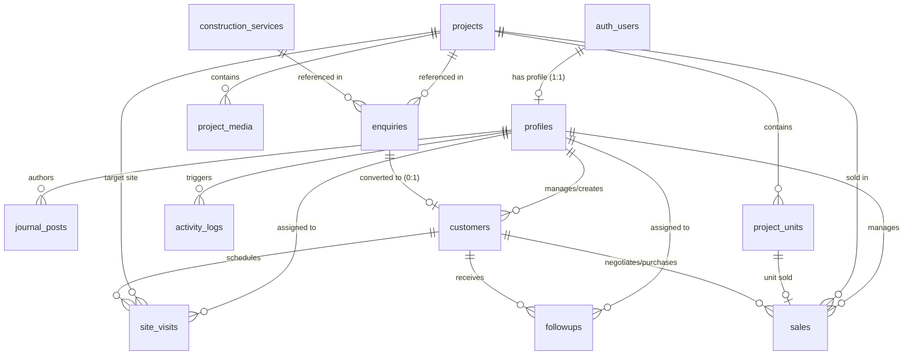

# Viruksham Estates — Database Relationships & Constraints (Hardened Phase 1A)

## 1. Entity-Relationship Diagram (Mermaid)



---

## 2. Foreign Key & Deletion Behavior Matrix

| Parent Entity | Child Entity | Foreign Key Column | Deletion Strategy | Rationale |
| :--- | :--- | :--- | :--- | :--- |
| `auth.users` | `profiles` | `profiles.id` | `CASCADE` | If auth account is deleted, admin profile is purged. |
| `projects` | `project_media` | `project_media.project_id` | `CASCADE` | Media assets belong exclusively to the parent project. |
| `projects` | `project_units` | `project_units.project_id` | `CASCADE` | Unit listings belong exclusively to the parent project. |
| `projects` | `enquiries` | `enquiries.project_id` | `SET NULL` | Preserves public enquiry record even if project is deleted. |
| `construction_services` | `enquiries` | `enquiries.construction_service_id` | `SET NULL` | Preserves public enquiry record if service offering is archived. |
| `projects` | `site_visits` | `site_visits.project_id` | `SET NULL` | Retains site visit log even if project details are removed. |
| `projects` | `sales` | `sales.project_id` | `RESTRICT` | Prevents deleting a project associated with active/historical financial sales. |
| `customers` | `sales` | `sales.customer_id` | `RESTRICT` | Protects customer records connected to active financial sales opportunities. |
| `customers` | `site_visits` | `site_visits.customer_id` | `CASCADE` | Purges scheduled visits if customer CRM record is deleted. |
| `customers` | `followups` | `followups.customer_id` | `CASCADE` | Purges task logs if customer CRM record is deleted. |
| `profiles` | `journal_posts` | `journal_posts.author_id` | `SET NULL` | Retains published article content with denormalized author name. |

---

## 3. Disambiguation & Customer Uniqueness

### 3.1. Duplicate Display Names Handling
In real estate, development projects in different regions may share identical display titles (e.g. *"Anugraham Nagar"* in Chennai vs *"Anugraham Nagar"* in Madurai).
- **Primary Key Primacy:** Foreign keys and CRM sales reference the immutable `UUID` primary key (`id`).
- **Slug Disambiguation:** The `slug` column enforces a global `UNIQUE` constraint by appending locality suffixes (e.g. `anugraham-nagar-chennai` vs `anugraham-nagar-madurai`).

### 3.2. Customer Duplicate Prevention
- `customers.phone` carries a `UNIQUE` index to prevent creating duplicate CRM customer records during manual entry or enquiry conversion.

---

## 4. Indexing Strategy

```sql
-- Public Project Lookups
CREATE UNIQUE INDEX idx_projects_slug ON projects(slug);
CREATE INDEX idx_projects_public_filter ON projects(category, status, is_published, display_order);

-- Construction Services Lookups
CREATE UNIQUE INDEX idx_construction_services_slug ON construction_services(slug);
CREATE INDEX idx_construction_services_public ON construction_services(is_published, display_order);

-- Journal Post Lookups
CREATE UNIQUE INDEX idx_journal_posts_slug ON journal_posts(slug);
CREATE INDEX idx_journal_posts_published ON journal_posts(is_published, published_at DESC);

-- Project Media
CREATE INDEX idx_project_media_project ON project_media(project_id, display_order);

-- CRM Pipeline & Searches
CREATE UNIQUE INDEX idx_customers_phone ON customers(phone);
CREATE INDEX idx_customers_email ON customers(email);
CREATE INDEX idx_enquiries_status_date ON enquiries(status, created_at DESC);
CREATE INDEX idx_site_visits_scheduled ON site_visits(scheduled_at, status);
CREATE INDEX idx_sales_pipeline ON sales(stage, assigned_to);
CREATE INDEX idx_followups_due ON followups(assigned_to, status, due_date);
```
