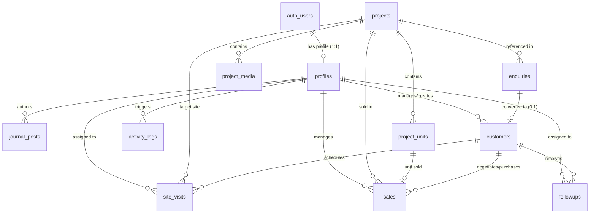

# Viruksham Estates — Database Relationships & Constraints

## 1. Entity-Relationship Diagram (Mermaid)



---

## 2. Foreign Key & Deletion Behavior Matrix

| Parent Entity | Child Entity | Foreign Key Column | Deletion Strategy | Rationale |
| :--- | :--- | :--- | :--- | :--- |
| `auth.users` | `profiles` | `profiles.id` | `CASCADE` | If auth account is deleted, admin profile is purged. |
| `projects` | `project_media` | `project_media.project_id` | `CASCADE` | Media assets belong exclusively to the parent project. |
| `projects` | `project_units` | `project_units.project_id` | `CASCADE` | Unit listings belong exclusively to the parent project. |
| `projects` | `enquiries` | `enquiries.project_id` | `SET NULL` | Preserves public enquiry record even if project is deleted. |
| `projects` | `site_visits` | `site_visits.project_id` | `SET NULL` | Retains site visit log even if project details are removed. |
| `projects` | `sales` | `sales.project_id` | `RESTRICT` | Prevents deleting a project associated with active/historical financial sales. |
| `customers` | `sales` | `sales.customer_id` | `RESTRICT` | Protects customer records connected to active financial sales opportunities. |
| `customers` | `site_visits` | `site_visits.customer_id` | `CASCADE` | Purges scheduled visits if customer CRM record is deleted. |
| `customers` | `followups` | `followups.customer_id` | `CASCADE` | Purges task logs if customer CRM record is deleted. |
| `profiles` | `journal_posts` | `journal_posts.author_id` | `SET NULL` | Retains published article content with denormalized author name. |

---

## 3. Disambiguation Strategy for Duplicate Display Names

In real estate, development projects in different regions may share identical display titles (e.g. *"Viruksham Gardens"* in Chennai vs *"Viruksham Gardens"* in Coimbatore).

### Database Handling Rules:
1. **Primary Key Primacy:** Internal queries, foreign keys, CRM sales, and unit assignments strictly reference the immutable `UUID` primary key (`id`).
2. **Slug Disambiguation:** The `slug` column enforces a global `UNIQUE` constraint. Slugs append locality or numerical identifiers when display titles overlap:
   - Project 1: Title = `"Viruksham Gardens"`, Location = `"Chennai"`, Slug = `viruksham-gardens-chennai`
   - Project 2: Title = `"Viruksham Gardens"`, Location = `"Coimbatore"`, Slug = `viruksham-gardens-coimbatore`
3. **URL Routing Safety:** Public routes (`/projects/[slug]`) locate projects via the indexed `slug` column.

---

## 4. Indexing Strategy for Performance & Filtering

To guarantee fast query execution across public pages and internal CRM views, the following indexes are defined:

### 4.1. Public Site Queries (Fast Filtering & Slug Lookups)
```sql
-- Project lookup by URL slug
CREATE UNIQUE INDEX idx_projects_slug ON projects(slug);

-- Public project catalogue filtering (category, status, publication state)
CREATE INDEX idx_projects_public_filter ON projects(category, status, is_published, display_order);

-- Journal article slug lookup & publication sorting
CREATE UNIQUE INDEX idx_journal_posts_slug ON journal_posts(slug);
CREATE INDEX idx_journal_posts_published ON journal_posts(is_published, published_at DESC);

-- Project media order lookup
CREATE INDEX idx_project_media_project ON project_media(project_id, display_order);
```

### 4.2. CRM & Administrative Views (Pipeline & Date Filters)
```sql
-- Customer phone/email search
CREATE INDEX idx_customers_phone ON customers(phone);
CREATE INDEX idx_customers_email ON customers(email);

-- Enquiry management by status & creation date
CREATE INDEX idx_enquiries_status_date ON enquiries(status, created_at DESC);

-- Site visit schedule tracking
CREATE INDEX idx_site_visits_scheduled ON site_visits(scheduled_at, status);

-- Sales pipeline by stage & assignment
CREATE INDEX idx_sales_pipeline ON sales(stage, assigned_to);

-- Followup tasks due date search
CREATE INDEX idx_followups_due ON followups(assigned_to, status, due_date);
```
